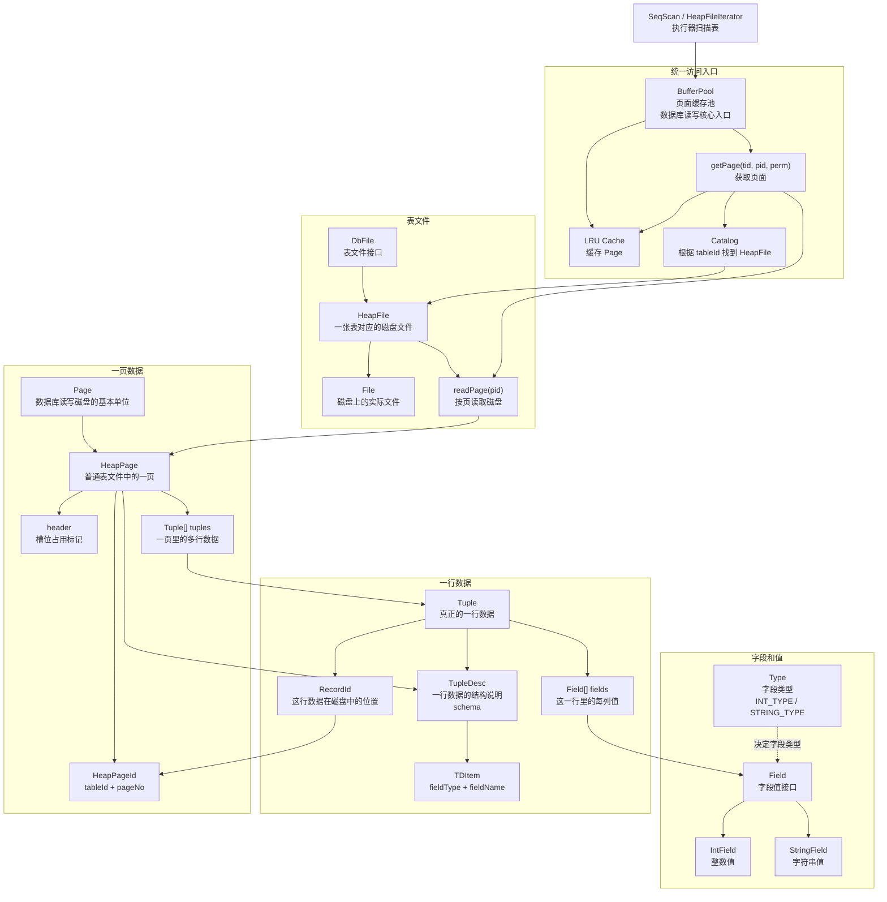

# 01. 第一阶段：学存储模型

## 优先阅读的类

```text
src/main/java/simpledb/common/Type.java
src/main/java/simpledb/storage/Field.java
src/main/java/simpledb/storage/IntField.java
src/main/java/simpledb/storage/StringField.java
src/main/java/simpledb/storage/TupleDesc.java
src/main/java/simpledb/storage/Tuple.java
src/main/java/simpledb/storage/Page.java
src/main/java/simpledb/storage/HeapPage.java
src/main/java/simpledb/storage/HeapFile.java
src/main/java/simpledb/storage/BufferPool.java
```

## 核心概念

- `TupleDesc`：一张表的 schema，也就是每列的类型和名字。
- `Tuple`：一行数据。
- `Field`：一列的值，比如 int 或 string。
- `Page`：磁盘页，数据库读写的基本单位。
- `HeapPage`：普通表文件里的一个页。
- `HeapFile`：一张表对应的磁盘文件。
- `BufferPool`：缓存池，所有页面读写都要经过它。

## 学习目标

- 一行数据 `Tuple` 如何被描述？
- 一页 `HeapPage` 里如何放多行 `Tuple`？
- `HeapFile` 如何从磁盘读出某一页？
- `BufferPool` 为什么是数据库的核心入口？

## 教授讲解笔记

第一阶段“存储模型”可以先记住一句话：

**数据库不是直接处理一整张表，而是把表拆成很多页；每一页里放很多行；每一行由多个字段组成。**

从小到大看，结构是：

```text
Field -> Tuple -> HeapPage -> HeapFile -> BufferPool
字段      一行      一页        一张表文件     数据库读写入口
```

### 1. Field：一个格子的值

可以把一张表想象成 Excel：

```text
id | name | age
1  | Tom  | 18
```

这里的 `1`、`Tom`、`18` 每一个都是一个 `Field`。

在 SimpleDB 里，字段值主要由这些类表示：

- `Field.java`
- `IntField.java`
- `StringField.java`

`IntField` 表示整数，`StringField` 表示字符串。

### 2. TupleDesc：一行数据的说明书

`TupleDesc` 不是数据本身，它描述“一行长什么样”。

比如：

```text
id INT, name STRING, age INT
```

这就是 schema，也就是表结构。

在代码里，`TupleDesc` 里面有一个 `TDItem`，它保存两件事：

```java
fieldType
fieldName
```

也就是“这一列是什么类型”和“这一列叫什么名字”。

所以可以这样理解：

```text
TupleDesc = 表头 + 每列类型
```

比如：

```text
第 0 列：id，INT
第 1 列：name，STRING
第 2 列：age，INT
```

### 3. Tuple：真正的一行数据

`Tuple` 才是一行真实数据。

它有三个核心字段：

```java
private TupleDesc tupleDesc;
private Field[] fields;
private RecordId recordId;
```

翻译成人话：

```text
tupleDesc：这行数据的结构说明
fields：这一行里每一列的值
recordId：这一行在磁盘上的位置
```

例如：

```text
TupleDesc: id INT, name STRING, age INT
fields:    1,      Tom,         18
```

这就是一行 `Tuple`。

`RecordId` 可以先简单理解成：

```text
RecordId = 这行数据住在哪一页、页里的第几个位置
```

### 4. Page：数据库读写磁盘的基本单位

数据库不会每次只从磁盘读一行。那样太慢了。

它一般一次读一整页，比如 4096 字节。SimpleDB 里这个页大小由 `BufferPool.getPageSize()` 决定。

所以磁盘文件大概长这样：

```text
HeapFile
 ├── Page 0
 ├── Page 1
 ├── Page 2
 └── Page 3
```

每个 `Page` 里面再放多行 `Tuple`。

### 5. HeapPage：普通表文件中的一页

`HeapPage` 是第一阶段最关键的类之一。

它里面大概有：

```java
final HeapPageId pid;
final TupleDesc td;
byte[] header;
Tuple[] tuples;
```

可以这样看：

```text
HeapPage
 ├── pid：这是哪张表的第几页
 ├── td：这一页里 tuple 的结构
 ├── header：哪些槽位已经被占用
 └── tuples：真正存放多行数据的数组
```

这里的 `header` 很重要。

一页里不是简单无限塞 `Tuple`，而是分成很多固定槽位：

```text
HeapPage
 ├── slot 0: Tuple
 ├── slot 1: empty
 ├── slot 2: Tuple
 └── slot 3: Tuple
```

那怎么知道哪个 slot 有数据、哪个 slot 是空的？靠 `header`：

```text
header bit = 1，表示这个槽位有 Tuple
header bit = 0，表示这个槽位空着
```

所以 `HeapPage` 的本质是：

```text
一块固定大小的字节空间 + 一组槽位 + 一个占用标记表
```

### 6. HeapFile：一张表对应的磁盘文件

`HeapFile` 表示磁盘上的一个表文件。

可以把它理解成：

```text
HeapFile = 存放很多 HeapPage 的文件
```

如果一页是 4096 字节，那么：

```text
第 0 页：文件偏移 0
第 1 页：文件偏移 4096
第 2 页：文件偏移 8192
```

所以 `HeapFile.readPage(pid)` 做的事情大概就是：

```text
根据 pageNo 算出偏移量
从文件里读出 pageSize 个字节
把这些字节解析成 HeapPage
```

注意：`HeapFile` 负责“磁盘文件怎么读写”，但它不应该是所有代码直接访问的入口。

### 7. BufferPool：数据库的核心入口

`BufferPool` 是第一阶段最值得认真理解的类。

它解决的问题是：

```text
磁盘很慢，内存很快。
能不能把读过的页缓存起来，下次直接从内存拿？
```

所以 `BufferPool.getPage(...)` 大概流程是：

```text
1. 先申请锁
2. 看缓存里有没有这个 Page
3. 如果有，直接返回
4. 如果没有，从 HeapFile 读磁盘
5. 放进缓存
6. 返回 Page
```

也就是说：

```text
执行器想读数据
   -> 找 BufferPool
      -> BufferPool 决定从缓存拿，还是从 HeapFile 读磁盘
```

这就是为什么 `BufferPool` 是数据库的核心入口。

### 完整流程

假设执行：

```sql
SELECT * FROM users;
```

底层大概发生：

```text
SeqScan 想扫描 users 表
 -> 通过 HeapFileIterator 遍历表的每一页
 -> 每一页都通过 BufferPool.getPage() 获取
 -> BufferPool 缓存没有，就让 HeapFile.readPage() 从磁盘读
 -> HeapFile 读出字节，构造 HeapPage
 -> HeapPage 解析出多个 Tuple
 -> SeqScan 一行一行把 Tuple 往上吐
```

第一阶段要建立的脑内地图是：

```text
TupleDesc 描述一行的结构
Tuple 保存一行的值
HeapPage 保存一页里的多行 Tuple
HeapFile 保存磁盘上的很多页
BufferPool 负责统一读取和缓存页面
```

建议阅读顺序：

1. 先看 `TupleDesc`：理解 schema。
2. 再看 `Tuple`：理解一行数据怎么保存。
3. 再看 `HeapPage`：理解一页如何放很多行。
4. 再看 `HeapFile`：理解磁盘文件如何按页读取。
5. 最后看 `BufferPool`：理解为什么所有读写都要经过它。

现在先别急着学事务、锁、优化器。第一阶段的目标很朴素：**能把“一张表在 SimpleDB 里是怎么变成文件、页、行、字段的”讲清楚。**
## Mermaid 理解图

这张图可以当成第一阶段的“地图”。从下往上看，就是数据从磁盘文件一路变成一行行 `Tuple` 的过程。



最核心的记忆链路是：

```text
Field 组成 Tuple
Tuple 放进 HeapPage
HeapPage 存在 HeapFile
读 HeapPage 要经过 BufferPool
```

也就是：

```text
字段 -> 一行 -> 一页 -> 一个表文件 -> 缓存池统一读取
```
## 学习进度

- 开始日期：
- 完成日期：
- 当前状态：未开始
- 本阶段目标：
- 已阅读类：
- 已运行测试：
- 理解笔记：
- 遇到的问题：
- 下一步：
