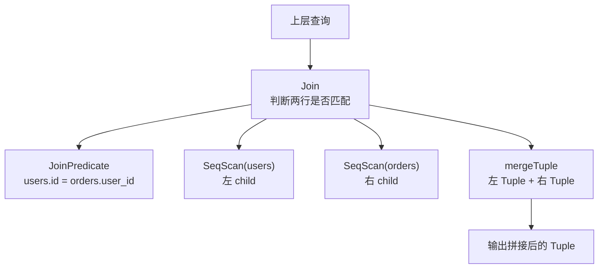

# 02. 第二阶段：学执行器 Volcano 模型

## 优先阅读的类

```text
src/main/java/simpledb/execution/OpIterator.java
src/main/java/simpledb/execution/Operator.java
src/main/java/simpledb/execution/SeqScan.java
src/main/java/simpledb/execution/Filter.java
src/main/java/simpledb/execution/Join.java
src/main/java/simpledb/execution/Aggregate.java
src/main/java/simpledb/execution/Insert.java
src/main/java/simpledb/execution/Delete.java
```

## 核心模型

SimpleDB 使用的是 Volcano 模型，也就是每个算子都像迭代器：

```java
open();
while (hasNext()) {
    Tuple t = next();
}
close();
```

可以把 SQL 想象成一棵执行树：

```sql
SELECT * FROM users WHERE age > 18;
```

大概对应：

```text
Filter(age > 18)
    |
 SeqScan(users)
```

`SeqScan` 一行一行吐数据，`Filter` 判断条件，符合就继续往上吐。

## 教授讲解笔记

第二阶段可以先记住一句话：

**第一阶段学的是 `Tuple` 怎么存在磁盘里；第二阶段学的是 `Tuple` 怎么被一行一行取出来，并在算子之间流动。**

执行器的核心思想是 Volcano 模型。它不是一次性把 SQL 的所有结果全部算完，而是让每个算子都像迭代器一样工作：

```java
op.open();
while (op.hasNext()) {
    Tuple tuple = op.next();
}
op.close();
```

也就是说，上层算子不断向下层算子要数据：

```text
上层问下层：你还有下一行吗？
下层回答：有，给你。
```

### 1. OpIterator：所有算子的共同语言

`OpIterator` 是一个接口，它规定 SimpleDB 里的执行算子都必须支持这些方法：

```java
open();
hasNext();
next();
rewind();
getTupleDesc();
close();
```

这套接口让不同算子可以用同一种方式连接起来。

比如上层不需要知道下层到底是 `SeqScan`、`Filter`、`Join` 还是 `Aggregate`，只要下层实现了 `OpIterator`，上层就可以调用：

```java
child.hasNext();
child.next();
```

这就是执行器里的抽象统一。

### 2. Operator：帮具体算子处理通用迭代逻辑

`Operator` 是一个抽象类，实现了 `OpIterator` 的一部分通用逻辑。

它帮具体算子处理：

- `hasNext()`
- `next()`
- `open()` 状态
- `close()` 状态
- 临时缓存下一条 `Tuple`

具体算子只需要重点实现：

```java
protected abstract Tuple fetchNext();
```

可以这样理解：

```text
Operator 负责通用流程
具体算子负责“怎么找出下一条结果”
```

`Filter`、`Join`、`Aggregate` 这类算子通常都继承 `Operator`。

### 3. SeqScan：最基础的真实算子

`SeqScan` 的意思是 sequential scan，也就是顺序扫描。

它做的事情很朴素：

```text
从一张表的第一页开始
一页一页读
一行一行吐出 Tuple
直到表结束
```

它刚好能把第一阶段的存储模型串起来：

```text
SeqScan
 -> DbFileIterator / HeapFileIterator
 -> BufferPool.getPage()
 -> HeapFile.readPage()
 -> HeapPage
 -> Tuple
```

所以 `SeqScan` 是执行器和存储层之间的第一座桥。

### 4. SeqScan 的核心方法

`SeqScan.open()` 会打开底层的 `dbFileIterator`：

```java
this.dbFileIterator.open();
```

可以理解为：

```text
SeqScan：我要开始扫描表了
HeapFileIterator：好，我准备从第 0 页开始读
```

`SeqScan.hasNext()` 会询问底层迭代器是否还有下一行：

```java
return this.dbFileIterator.hasNext();
```

`SeqScan.next()` 会从底层取出一条 `Tuple`，然后重新包装成带表别名的输出 `Tuple`。

比如原始字段名是：

```text
id, name, age
```

如果表别名是 `users`，扫描出来的字段名会变成：

```text
users.id, users.name, users.age
```

这样以后做 `join` 时，两张表都有 `id` 字段也不容易混淆。

### 5. Filter：第一个“包住另一个算子”的算子

`Filter` 对应 SQL 里的 `WHERE` 条件。

比如：

```sql
SELECT * FROM users WHERE age > 18;
```

执行树大概是：

```text
Filter(age > 18)
    |
 SeqScan(users)
```

`SeqScan` 负责把 `users` 表里的所有行一行一行吐出来。

`Filter` 负责判断每一行：

```text
age > 18 ？留下
age <= 18 ？丢掉
```

所以 `Filter` 本质上是一个筛子。

### 6. Predicate：过滤条件

`Predicate` 表示一个条件，比如：

```text
第 2 列 > 18
```

它有三个核心字段：

```java
private int field;
private Op op;
private Field operand;
```

含义是：

```text
field：要检查 Tuple 的第几列
op：比较符号，比如 >、<、=、!=
operand：右边用来比较的值
```

比如 `age > 18` 可以理解成：

```text
field = 2
op = GREATER_THAN
operand = IntField(18)
```

真正判断时，`Predicate.filter(tuple)` 会：

```text
从 Tuple 里拿出第 field 列
和 operand 比较
如果满足 op，就返回 true
```

### 7. Filter 的核心字段

`Filter` 里面有三个关键成员：

```java
private Predicate predicate;
private OpIterator child;
private TupleDesc tupleDesc;
```

可以这样理解：

```text
predicate：过滤规则
child：下面那个算子，比如 SeqScan
tupleDesc：输出 Tuple 的结构
```

`Filter` 不改变字段数量，也不改变字段类型。它只是筛掉一些行，所以它的输出结构和子算子的输出结构一样。

### 8. Filter.open() 和 Filter.close()

`Filter.open()` 会先打开子算子，再打开自己：

```java
child.open();
super.open();
```

因为 `Filter` 自己没有数据，它的数据全部来自 `child`。

`Filter.close()` 会关闭子算子，也关闭自己：

```java
child.close();
super.close();
```

### 9. Filter.fetchNext()：过滤算子的灵魂

`Filter` 继承了 `Operator`，所以它不用自己写 `hasNext()` 和 `next()`，只需要实现 `fetchNext()`。

核心逻辑是：

```java
while (this.child.hasNext()) {
    tuple = this.child.next();
    if (tuple != null) {
        if (this.predicate.filter(tuple)) {
            return tuple;
        }
    }
}
return null;
```

翻译成人话：

```text
一直向 child 要 Tuple
拿到一行，就用 predicate 判断
如果符合条件，就返回这行
如果不符合，就继续要下一行
如果 child 没数据了，就返回 null
```

比如表里有这些数据：

```text
id | name | age
1  | Tom  | 16
2  | Amy  | 20
3  | Bob  | 17
4  | Jay  | 22
```

执行：

```sql
WHERE age > 18
```

过程是：

```text
Filter 向 SeqScan 要一行 -> Tom, 16 -> 不满足，丢掉
Filter 向 SeqScan 要一行 -> Amy, 20 -> 满足，返回
Filter 再被调用       -> Bob, 17 -> 不满足，丢掉
Filter 再向下要       -> Jay, 22 -> 满足，返回
```

最终往上吐出的只有：

```text
Amy, 20
Jay, 22
```

### 10. 当前阶段的脑内地图

第一阶段站在存储层看数据：

```text
Tuple 在 Page 里，Page 在 HeapFile 里
```

第二阶段站在执行层看数据：

```text
算子通过 next() 一行一行拿 Tuple
```

目前学过的执行链路是：

```text
用户写 SQL
   |
执行器生成执行树
   |
Filter.open()
   |
SeqScan.open()
   |
Filter.hasNext() / Filter.next()
   |
Filter.fetchNext()
   |
SeqScan.hasNext() / SeqScan.next()
   |
HeapFileIterator.next()
   |
BufferPool.getPage()
   |
HeapPage.iterator()
   |
Tuple
```

最关键的一句话是：

**`SeqScan` 负责“产出所有 Tuple”，`Filter` 负责“只放过满足条件的 Tuple”。**

下一步适合学习 `Join`，因为 `Join` 会从“一个 child”升级到“两个 child”，执行树会更像真正的 SQL 查询。
### 11. Join：两个 child 之间配对数据

`Join` 比 `Filter` 更进一步：

**`Filter` 是一个 child 里筛数据；`Join` 是两个 child 之间配对数据。**

比如有两张表：

```text
users
id | name
1  | Tom
2  | Amy

orders
user_id | item
1       | Book
1       | Pen
2       | Phone
```

SQL：

```sql
SELECT *
FROM users, orders
WHERE users.id = orders.user_id;
```

执行树大概是：

```text
Join(users.id = orders.user_id)
        /              \
 SeqScan(users)   SeqScan(orders)
```

`SeqScan(users)` 一行一行吐用户，`SeqScan(orders)` 一行一行吐订单。

`Join` 做的事就是：

```text
拿 users 的一行
拿 orders 的一行
判断 users.id 是否等于 orders.user_id
如果匹配，就合成一行输出
```

### 12. JoinPredicate：两行之间的判断条件

之前 `Filter` 用的是 `Predicate`：

```text
一个 Tuple 的某一列 vs 一个固定值
age > 18
```

`Join` 用的是 `JoinPredicate`：

```text
一个 Tuple 的某一列 vs 另一个 Tuple 的某一列
users.id = orders.user_id
```

它有三个核心字段：

```java
private int field1;
private int field2;
private Predicate.Op op;
```

含义是：

```text
field1：左边 Tuple 的第几列
field2：右边 Tuple 的第几列
op：比较符号，比如 =、>、<
```

核心判断逻辑是：

```java
return t1.getField(this.field1).compare(this.op, t2.getField(this.getField2()));
```

翻译一下：

```text
从左 Tuple 拿 field1
从右 Tuple 拿 field2
用 op 比较
满足就返回 true
```

### 13. Join 有两个 child

`Join` 里面最关键的字段是：

```java
private JoinPredicate joinPredicate;
private OpIterator child1;
private OpIterator child2;
private TupleDesc td;
```

可以这样理解：

```text
joinPredicate：连接条件
child1：左表的数据来源
child2：右表的数据来源
td：连接后输出 Tuple 的结构
```

这和 `Filter` 很像，但 `Filter` 只有一个 child：

```text
Filter
  |
child
```

`Join` 有两个 child：

```text
    Join
   /    \
child1 child2
```

### 14. Join 输出的 Tuple 长什么样

假设左边 Tuple 是：

```text
users: 1, Tom
```

右边 Tuple 是：

```text
orders: 1, Book
```

匹配成功后，`Join` 输出的是拼接后的 Tuple：

```text
1, Tom, 1, Book
```

注意：连接字段会保留两份。

比如 `users.id = orders.user_id`，结果里既有 `users.id`，也有 `orders.user_id`。如果想去掉重复列，后面可以用 `Project` 算子。

`Join` 构造函数会把左右两边的 `TupleDesc` 合并起来：

```java
tdItems.addAll(td1.getDescList());
tdItems.addAll(td2.getDescList());
this.td = new TupleDesc(tdItems);
```

也就是：

```text
左表 schema + 右表 schema = Join 输出 schema
```

### 15. 当前项目使用 NestedLoopJoin

当前 `Join.open()` 里选择的是：

```java
this.joinStrategy = new NestedLoopJoin(child1, child2, this.td, this.joinPredicate);
this.iterator = this.joinStrategy.doJoin();
this.iterator.open();
```

也就是说，`Join` 本身不直接写匹配算法，而是交给 `JoinStrategy`。

当前实际使用的是最容易理解的：

```text
Nested Loop Join
嵌套循环连接
```

### 16. NestedLoopJoin 怎么工作

核心逻辑是：

```java
child1.rewind();
while (child1.hasNext()) {
    final Tuple lTuple = child1.next();

    child2.rewind();
    while (child2.hasNext()) {
        final Tuple rTuple = child2.next();

        if (this.joinPredicate.filter(lTuple, rTuple)) {
            tuples.add(mergeTuple(lTuple, rTuple, this.td));
        }
    }
}
```

翻译成人话：

```text
遍历左表每一行
    对于左表当前这一行，重新遍历右表每一行
        如果两行满足 join 条件
            把两行拼起来，加入结果
```

这就是双层循环。

用前面的例子看：

```text
users
1 Tom
2 Amy

orders
1 Book
1 Pen
2 Phone
```

执行过程：

```text
Tom 和 Book 比：1 = 1，匹配，输出 Tom + Book
Tom 和 Pen 比：1 = 1，匹配，输出 Tom + Pen
Tom 和 Phone 比：1 = 2，不匹配

Amy 和 Book 比：2 = 1，不匹配
Amy 和 Pen 比：2 = 1，不匹配
Amy 和 Phone 比：2 = 2，匹配，输出 Amy + Phone
```

最终结果：

```text
1 Tom 1 Book
1 Tom 1 Pen
2 Amy 2 Phone
```

### 17. mergeTuple：把两行合成一行

`JoinStrategy.mergeTuple()` 做的是拼接字段：

```java
for (int i = 0; i < len1; i++) {
    tuple.setField(i, tuple1.getField(i));
}
for (int i = 0; i < tuple2.getTupleDesc().numFields(); i++) {
    tuple.setField(i + len1, tuple2.getField(i));
}
```

也就是：

```text
先放左 Tuple 的所有字段
再放右 Tuple 的所有字段
```

### 18. Join.fetchNext() 为什么很简单

当前 `Join.fetchNext()` 是：

```java
if (this.iterator.hasNext()) {
    return this.iterator.next();
}
return null;
```

因为真正的 join 结果已经在 `open()` 时通过下面这句提前算成了一个 `TupleIterator`：

```java
this.iterator = this.joinStrategy.doJoin();
```

所以当前实现的流程是：

```text
Join.open()
  -> 打开 child1 和 child2
  -> 用 NestedLoopJoin 算出所有匹配结果
  -> 存进 TupleIterator

Join.fetchNext()
  -> 从 TupleIterator 里一行一行取结果
```

更高级的数据库通常会边算边吐，但这个项目目前这样写更适合学习和理解。

### 19. Join 和 Filter 对比

```text
Filter:
一个 child
拿一行 Tuple
判断 Tuple 是否满足条件
满足就输出原 Tuple
```

```text
Join:
两个 child
拿左 Tuple 和右 Tuple
判断两行是否满足连接条件
满足就输出拼接后的 Tuple
```

最核心的区别：

```text
Filter 是“筛掉行”
Join 是“组合行”
```

### 20. Join 脑内地图



现在先记住这句话：

**`Join` 会拿左边一行和右边一行做比较；满足 `JoinPredicate` 就把两行拼成一行输出。**

下一步可以继续看 `Aggregate`，因为它会从“一行一行输出”进入“多行归并成一个结果”的思路，比如 `COUNT`、`SUM`、`AVG`。
## 学习进度

- 开始日期：
- 完成日期：
- 当前状态：未开始
- 本阶段目标：
- 已阅读类：
- 已运行测试：
- 理解笔记：
- 遇到的问题：
- 下一步：
